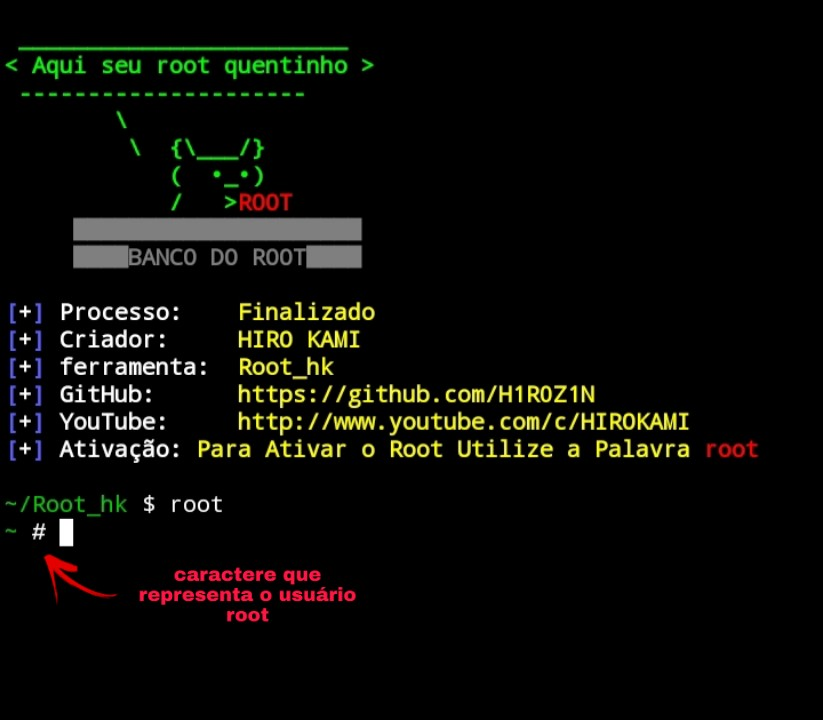

# Root_hk

   
<b>INTRODUÇÃO: </b>Basicamente serve para que os usuários do termux possam instalar á função root no seu terminal que lhes dão privilégios de um usuário root sem ter que realmente instalar o root em seu aparelho celular

   

   
<b>MODO DE USO: </b>Depois de ter feito á instalação basta digitar á palavra <b>root</b> em seu terminal para ativar o modo de usuário root

## Instalação
* git clone https://github.com/H1R0Z1N/Root_hk
* cd Root_hk
* bash install.sh
* ./start

## print da ferramenta
</img>

<b>Obs: </b>como todos sabem o caractere $ é para usuários normais que usam o sudo para usar comandos de administrador, e o caractere # para usuários root que já são admin e não precisam digitar sudo no final do cód para obter o privilégio de administrador

## Créditos

YouTube: <a href="https://youtube.com/channel/UCeYIzzzMCs-RVI8BJpG3KGg">HIRO KAMI</a>

Instagram: <a href="https://github.com/H1R0Z1N">@the_hiro_kami</a>

Git hub: <a href="https://github.com/H1R0Z1N">H1R0Z1N</a>

